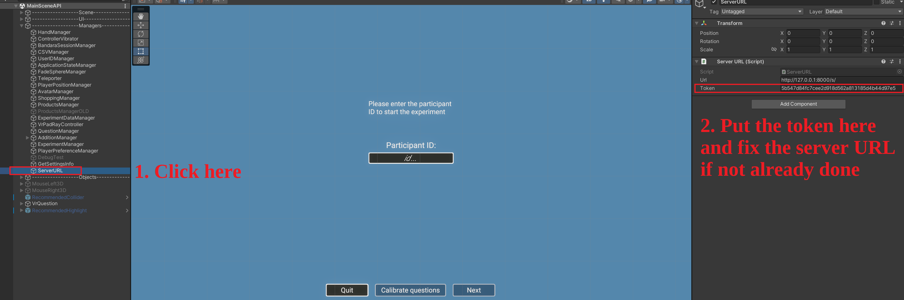

# Instructions to run the API

## 1. Install the dependencies

Before running the program, please install the dependencies in [requirements.txt](requirements.txt) by typing:
```
pip install -r requirements.txt
```
## 3. OPTIONAL: Save the data from the database
To save the data, please run the following commands:
```
pg_dump -U <database_user> -E utf-8 --create <database_name> > dataNew.sql
```
again where you replace `<database_user>` and `<database_name>` by the desired values.

> For an unknown reason, the data is not saved in UTF-8 format but in UTF-16, which will cause some problems during the load. To save the data in UTF-8 format, please open the saved data with a text editor and save it in UTF-8 format.

## 4. Run the server
Start the server by typing:
```
python manage.py runserver
```

> &#x26a0;&#xfe0f; **For the final version, do not forget to modify `DEBUG = True` to `DEBUG = False` in [portal/settings.py](portal/settings.py)** 

## 5. Access the admin page
To access the admin page, please go to [http://127.0.0.1:8000/admin/](http://127.0.0.1:8000/admin/). Login with the superuser credentials.
Then, add the potential users to the database via the `Users` section. There is also a `Tokens` section where you can add the tokens for the users.

> &#x26a0;&#xfe0f; **You should create a least one token and inscribe it on the Unity program as shown in the screen for the Unity application to work !** 


## 6. Access the website
To access the website, please go to [http://127.0.0.1:8000/](http://127.0.0.1:8000/) and login with the superuser credentials or the credentials of the users you added to the database.

## 7. API URL links
The useful API URL links are as follows:
- [http://127.0.0.1:8000/](http://127.0.0.1:8000/): The main page of the website, where you can download the data generated by Unity in CSV or ZIP format 
- [http://127.0.0.1:8000/login](http://127.0.0.1:8000/login): Login page
- [http://127.0.0.1:8000/api/dataCSV/](http://127.0.0.1:8000/api/dataCSV/): See all the data generated by Unity in JSON format
- [http://127.0.0.1:8000/api/saveDataCSV/](http://127.0.0.1:8000/api/saveDataCSV/): Post the data generated by Unity in CSV format
